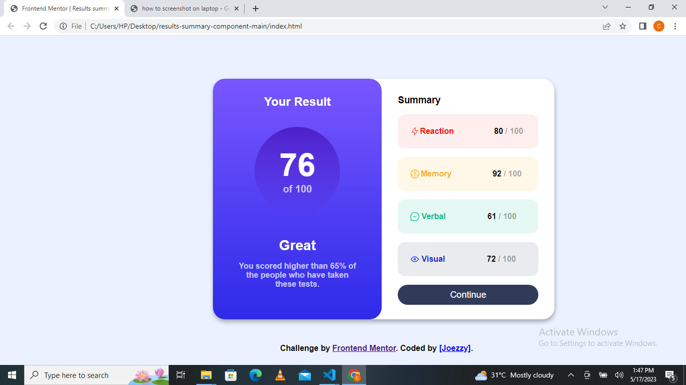

# Frontend Mentor - Results summary component solution

This is a solution to the [Results summary component challenge on Frontend Mentor](https://www.frontendmentor.io/challenges/results-summary-component-CE_K6s0maV). Frontend Mentor challenges help you improve your coding skills by building realistic projects. 


## Overview
This is a basic HTML and CSS solutioin to the QR code component challenge on Frontend Mentor.

### The challenge

Users should be able to:

- View the optimal layout for the interface depending on their device's screen size
- See hover and focus states for all interactive elements on the page

### Screenshot



### Links

- Solution URL: (https://github.com/Joezzyongit/results-summary-component.git)
- Live Site URL: [Add live site URL here](https://joezzyongit.github.io/results-summary-component/)

## My process
It was a long and stressful process, but what the time. I never imagined i will spend days working 
on this particular project, i learnt alot while building the solution and it was fun. Looking forward
to work on more creative projects


### Built with

- Semantic HTML5 markup
- CSS custom properties

### What I learned

i learnt how to make good use of some CSS custom properties

```css
.proud-of-this-css {
  flex-direction: column;
  gap: 1rem;
}
```

### Continued development
Diving more into CSS this project made me realize that there is a lot of cool CSS elements that can be
very useful which are not always used in practice.


## Author

- Frontend Mentor - [@Joezzyongit](https://www.frontendmentor.io/profile/@Joezzyongit)
- Twitter - [@Tyrex_on](https://www.twitter.com/Tyrex_on)


